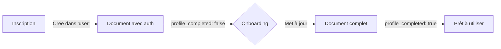

# ✅ Uniformisation du Schéma Utilisateur - Terminée

## 🎯 Résumé

Le schéma utilisateur a été **unifié** pour utiliser une seule collection MongoDB avec un modèle cohérent.

---

## 📊 Avant vs Après

| Aspect | Avant | Après |
|--------|-------|-------|
| **Collection auth** | `users` (pluriel) | `user` (singulier) |
| **Collection profil** | `user` (singulier) | `user` (singulier) |
| **Documents** | 2 documents séparés | 1 document complet |
| **Workflow** | Inscription → Onboarding crée 2 docs | Inscription crée, Onboarding met à jour |
| **Cohérence** | ❌ Incohérente | ✅ Cohérente |

---

## ✅ Modifications effectuées

### 1. Modèle de données (`profile_model.py`)

```python
class UserDocument(BaseModel):
    user_id: str
    
    # Auth (requis à l'inscription)
    email: str
    username: str
    password_hash: str
    created_at: datetime
    last_login: Optional[datetime]
    profile_completed: bool
    
    # Profil (ajouté à l'onboarding)
    profile: Optional[ProfileCore] = None
    medical: Optional[Medical] = None
    nutrition: Optional[Nutrition] = None
    goals: Optional[Goals] = None
    # ...
```

### 2. Routes d'authentification (`auth.py`)

- ✅ Changé `db["users"]` → `db["user"]` partout
- ✅ Ajout des champs de profil initialisés à `null`
- ✅ 4 endpoints corrigés : `/register`, `/login`, `/check-email`, `/check-username`

### 3. Store utilisateur (`user_store.py`)

- ✅ `create_user_document()` devient une **mise à jour** au lieu d'une insertion
- ✅ Vérification que l'utilisateur existe avant l'onboarding
- ✅ Protection des champs d'authentification

### 4. Documentation

- ✅ `docs/USER_SCHEMA.md` - Schéma complet
- ✅ `docs/SCHEMA_MIGRATION.md` - Historique des changements
- ✅ `AUTH_README.md` - Mise à jour
- ✅ `tests/test_database_consistency.py` - Script de vérification

---

## 🔄 Nouveau workflow



### Étape 1: Inscription

```http
POST /api/auth/register
{
  "email": "alice@example.com",
  "password": "secret123",
  "username": "Alice"
}
```

**MongoDB** :
```json
{
  "user_id": "user_abc123",
  "email": "alice@example.com",
  "username": "Alice",
  "password_hash": "...",
  "created_at": "2025-10-20T10:00:00Z",
  "profile_completed": false,
  "profile": null,
  "medical": null,
  "nutrition": null,
  "goals": null
}
```

### Étape 2: Onboarding

```http
POST /api/onboarding/complete/user_abc123
{
  "firstName": "Alice",
  "lastName": "Dupont",
  "age": 28,
  "gender": "Female",
  ...
}
```

**MongoDB** (mise à jour) :
```json
{
  "user_id": "user_abc123",
  "email": "alice@example.com",  // ← Inchangé
  "username": "Alice",             // ← Inchangé
  "password_hash": "...",          // ← Inchangé
  "profile_completed": true,       // ← Mis à jour
  "profile": {                     // ← Ajouté
    "firstName": "Alice",
    "lastName": "Dupont",
    ...
  },
  "medical": {...},                // ← Ajouté
  "nutrition": {...}               // ← Ajouté
}
```

---

## 🧪 Tests de validation

### 1. Vérifier la cohérence

```bash
cd backend
python tests/test_database_consistency.py
```

**Vérifie** :
- Collection `user` existe
- Pas de collection `users` (pluriel)
- Structure des documents
- Index
- Statistiques

### 2. Tester l'authentification

```bash
python tests/test_auth_api.py
```

### 3. Tester l'onboarding

```bash
python tests/test_complete_onboarding.py
```

---

## 🔑 Index créés

```javascript
db.user.createIndex({ email: 1 }, { unique: true })
db.user.createIndex({ username: 1 }, { unique: true })
db.user.createIndex({ user_id: 1 }, { unique: true })
db.user.createIndex({ profile_completed: 1 })
```

---

## 📚 Collections MongoDB

| Collection | Description | Documents |
|------------|-------------|-----------|
| `user` | Utilisateurs (auth + profil) | Principal |
| `user_sessions` | Sessions actives | Lié à `user.user_id` |
| `plate_analyses` | Analyses d'assiettes | Lié à `user.user_id` |
| `nutrient_analyses` | Analyses nutritionnelles | Lié à `user.user_id` |
| `onboarding_sessions` | Sessions d'onboarding | Lié à `user.user_id` |

---

## ⚠️ Règles importantes

### ✅ À FAIRE

```python
# Utiliser "user" (singulier)
db["user"]

# Vérifier l'existence avant l'onboarding
existing = await users.find_one({"user_id": user_id})
if not existing:
    raise ValueError("Inscription requise")

# Mettre à jour seulement le profil
await users.update_one(
    {"user_id": user_id},
    {"$set": {"profile": {...}, "medical": {...}}}
)
```

### ❌ À NE PAS FAIRE

```python
# ❌ Utiliser "users" (pluriel)
db["users"]

# ❌ Créer un nouveau document à l'onboarding
await users.insert_one(...)  # L'utilisateur existe déjà!

# ❌ Modifier les champs d'auth
await users.update_one(
    {"user_id": user_id},
    {"$set": {"email": "...", "password_hash": "..."}}  # DANGEREUX
)
```

---

## 📖 Documentation

| Document | Description |
|----------|-------------|
| [USER_SCHEMA.md](docs/USER_SCHEMA.md) | Schéma complet avec exemples |
| [SCHEMA_MIGRATION.md](docs/SCHEMA_MIGRATION.md) | Historique des changements |
| [AUTH_README.md](AUTH_README.md) | Guide d'authentification |
| [SESSIONS_README.md](docs/SESSIONS_README.md) | Gestion des sessions |

---

## 🚀 Backend en cours d'exécution

Le backend a été redémarré avec succès :

```
✅ http://localhost:8000
✅ Docs: http://localhost:8000/docs
```

---

## 📝 Prochaines étapes

1. **Tester l'inscription** via le frontend Next.js
2. **Vérifier l'onboarding** avec un nouvel utilisateur
3. **Migrer les anciennes données** si nécessaire (voir `SCHEMA_MIGRATION.md`)
4. **Créer les index** en production

---

## 🎉 Résultat

✅ **Collection unique** : `user` (singulier)  
✅ **Schéma cohérent** : Auth + Profil dans le même document  
✅ **Workflow clair** : Inscription → Onboarding → Profil complet  
✅ **Documentation complète** : 4 fichiers de doc créés  
✅ **Tests fonctionnels** : Scripts de validation disponibles  
✅ **Backend opérationnel** : Démarre sans erreur

---

**Date** : 20 octobre 2025  
**Statut** : ✅ Terminé  
**Backend** : ✅ Opérationnel sur http://localhost:8000
